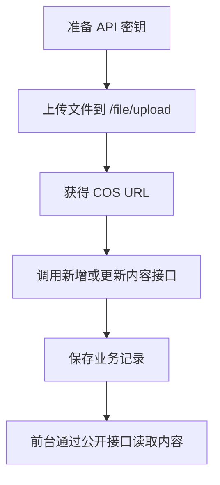

# OwnAI 内容上传边界与接口规范

本文档用于交给外部程序、协作者或自动化脚本负责人，按统一边界新增或更新 OwnAI 网站内容。

适用范围：

- Prompt 资产新增、更新、标签更新。
- 作品新增、更新。
- 内容相关图片、视频、Prompt 文件上传到 COS，并拿到可公开访问 URL。

不适用范围：

- 用户登录、注册、会员、订单、积分等用户业务。
- 图片生成任务、人工生成监控、API 生成监控。
- 数据库直连写入。外部程序不得直接写线上数据库。

## 1. 基本原则

1. 外部程序只能通过 HTTP API 写入内容，不允许直接连数据库。
2. 所有外部写入必须使用后台生成的 API 密钥。
3. 图片、视频等文件必须先上传，拿到 URL 后再写入内容接口。
4. API 密钥按最小权限发放，不要使用 `*` 给普通导入程序。
5. 密钥明文只在后台创建时显示一次，创建后请立即保存。
6. 不要把密钥写入前端代码、公开仓库、日志或聊天记录。

## 2. 环境地址

生产 API 基础地址：

```text
https://admin.ownai.icu/api
```

也可以使用 HTTP 内网/公网地址：

```text
http://admin.ownai.icu/api
```

推荐外部程序统一使用 HTTPS。

## 3. 密钥管理

后台入口：

```text
系统管理 > API 密钥管理
```

创建密钥时需要配置：

| 字段 | 说明 |
| --- | --- |
| 密钥名称 | 标明使用方，例如 `视觉资产导入程序` |
| 授权范围 | 选择该程序允许调用的接口 |
| 状态 | 启用 / 禁用 |
| 失效时间 | 建议设置，长期任务可留空 |
| 备注 | 写明用途、负责人、注意事项 |

可用授权范围：

| Scope | 能力 |
| --- | --- |
| `prompt_asset:add` | 新增 Prompt 资产、上传 Prompt 资产封面 |
| `prompt_asset:update` | 更新 Prompt 资产、更新标签、上传 Prompt 资产封面 |
| `artwork:add` | 新增作品、上传作品封面/视频/Prompt 文件 |
| `artwork:update` | 更新作品、上传作品封面/视频/Prompt 文件 |
| `*` | 全部内容资产能力，仅限可信内部自动化 |

推荐做法：

- 只导入 Prompt 资产：选择 `prompt_asset:add`、`prompt_asset:update`。
- 只导入作品：选择 `artwork:add`、`artwork:update`。
- 同时导入作品和 Prompt：选择四个具体 scope。
- 不建议给第三方使用 `*`。

## 4. 鉴权方式

推荐使用请求头：

```http
X-Content-Asset-Key: oak_7fCGrstWvL8DJdFWFgsMQakj8lNLDE4n0pFO1WvS9Rg
```

兼容方式：

```http
X-Content-Asset-Secret: oak_7fCGrstWvL8DJdFWFgsMQakj8lNLDE4n0pFO1WvS9Rg
```

请求体也可以传：

```json
{
  "apiSecret": "oak_7fCGrstWvL8DJdFWFgsMQakj8lNLDE4n0pFO1WvS9Rg"
}
```

优先级：

1. 请求体 `apiSecret`
2. 请求头 `X-Content-Asset-Key`
3. 请求头 `X-Content-Asset-Secret`

推荐外部程序只使用 `X-Content-Asset-Key`，避免密钥进入业务 JSON 或操作日志。

## 5. 标准上传流程

所有需要图片、视频、附件的内容，都按下面流程处理：



关键边界：

- `/file/upload` 只负责上传文件并返回 URL。
- Prompt 资产接口只保存标题、提示词、封面 URL、标签、分类等业务字段。
- 作品接口只保存作品标题、封面 URL、HTML URL、视频 URL 等业务字段。
- 不要把本地文件路径写入内容接口。

### 5.1 当前分类、状态与标签 ID 速查

以下 ID 来自线上系统当前 `category` / `category_tag` 数据，更新时间：`2026-07-04`。

#### 5.1.1 当前分类 ID

作品和 Prompt 资产都使用 `categoryId` 字段。当前可用分类如下：

| categoryId | 分类名称 | sort | 适用建议 |
| --- | --- | ---: | --- |
| `2045427516828106754` | 布局 | 0 | 作品分类 |
| `2045428812096290817` | 组件 | 1 | 作品分类 |
| `2045428876558548993` | 动效 | 2 | 作品分类 |
| `2045428928093962242` | 样式/主题 | 3 | 作品分类 |
| `2045428993533493249` | 落地页 | 4 | 作品分类 |
| `2071608263790104578` | 前端UI提示库 | 998 | Prompt / UI 相关资产 |
| `2057283059198771201` | 图像提示词 | 999 | 图像 Prompt 资产默认使用 |

#### 5.1.2 状态字段真实值

作品 `status`：

| 值 | 含义 | 前台是否展示 |
| --- | --- | --- |
| `0` | 下架 / 草稿 | 否 |
| `1` | 上架 / 已发布 | 是 |

作品上传默认要求：

- `status` 请传 `0`，表示默认下架。
- `memberOnly` 请传 `1`，表示会员专项。
- 如果不传 `status`，后端新增作品也会默认成 `0`。
- 如果不传 `memberOnly`，后端会默认成 `0`，所以会员专项必须显式传 `1`。

Prompt 资产 `status`：

| 值 | 含义 | 前台是否展示 |
| --- | --- | --- |
| `0` | 草稿 / 不发布 | 否 |
| `1` | 已发布 | 是 |
| `2` | 已归档 | 否 |

Prompt 上传默认要求：

- `status` 请传 `0`，这是系统真实代表“不发布 / 草稿”的值。
- `categoryId` 请传 `2057283059198771201`，即 `图像提示词`。
- `assetType` 请传 `image_prompt`。

#### 5.1.3 图像提示词二级场景标签 ID

`图像提示词` 分类 ID：`2057283059198771201`。

上传图像 Prompt 时，`sceneTagIdList` 从下表选择。当前系统约定：每条图像 Prompt 资产只绑定 1 个二级场景标签，因此 `sceneTagIdList` 建议只传一个 ID，例如 `"sceneTagIdList": [101912720625893377]`。

| sceneTagId | 二级场景标签 | sort |
| --- | --- | ---: |
| `101912720625893376` | 商品电商 | 10 |
| `101912720625893377` | 人像写真 | 20 |
| `101912720625893378` | 角色立绘 | 30 |
| `101912720625893379` | 品牌海报 | 40 |
| `101912720625893380` | 包装设计 | 50 |
| `101912720625893381` | 社媒封面 | 60 |
| `101912720625893382` | UI界面 | 70 |
| `101912720625893383` | 图标标识 | 80 |
| `101912720625893384` | 插画视觉 | 90 |
| `101912720625893385` | 摄影写实 | 100 |
| `101912720625893386` | 影视分镜 | 110 |
| `101912720625893387` | 场景空间 | 120 |
| `101912720625893388` | 建筑室内 | 130 |
| `101912720625893389` | 科技数码 | 140 |
| `101912720625893390` | 美食餐饮 | 150 |
| `101912720625893391` | 服装时尚 | 160 |
| `101912720625893392` | 游戏资产 | 170 |
| `101912720625893393` | 动漫二次元 | 180 |
| `101912720625893394` | 广告营销 | 190 |
| `101912720625893395` | 信息图表 | 200 |
| `101912720625893396` | 背景纹理 | 210 |
| `101912720625893397` | 图像编辑 | 220 |
| `101912720625893398` | 多图一致性 | 230 |
| `101912720625893399` | 参考图重绘 | 240 |

## 6. 文件上传接口

接口：

```http
POST /api/file/upload
Content-Type: multipart/form-data
X-Content-Asset-Key: oak_xxx
```

入参：

| 字段 | 类型 | 必填 | 说明 |
| --- | --- | --- | --- |
| `file` | file | 是 | 要上传的文件 |
| `biz` | string | 是 | 上传业务类型 |

返回：

```json
{
  "code": 0,
  "data": "https://bead-master-1316504135.cos.ap-guangzhou.myqcloud.com/xxx.png",
  "message": "ok"
}
```

支持的 `biz`：

| biz | 用途 | 所需 scope | 格式 | 大小 |
| --- | --- | --- | --- | --- |
| `prompt_asset_cover` | Prompt 资产封面 | `prompt_asset:add` 或 `prompt_asset:update` | jpg/jpeg/png/webp | <= 10MB |
| `artwork_cover` | 作品封面 | `artwork:add` 或 `artwork:update` | jpg/jpeg/png/webp | <= 10MB |
| `artwork_video` | 作品视频 | `artwork:add` 或 `artwork:update` | mp4/mov/webm/m4v | <= 50MB |
| `artwork_prompt` | 作品 Prompt 文件 | `artwork:add` 或 `artwork:update` | json/txt | <= 10MB |

示例：

```bash
curl -X POST "https://admin.ownai.icu/api/file/upload" \
  -H "X-Content-Asset-Key: oak_xxx" \
  -F "biz=prompt_asset_cover" \
  -F "file=@/path/to/cover.png;type=image/png"
```

成功后，把 `data` 里的 URL 写入 `coverUrl` 或对应媒体字段。

## 7. Prompt 资产新增

接口：

```http
POST /api/promptAsset/admin/add
Content-Type: application/json
X-Content-Asset-Key: oak_xxx
```

所需 scope：

```text
prompt_asset:add
```

常用入参：

| 字段 | 必填 | 说明 |
| --- | --- | --- |
| `assetType` | 是 | 资产类型，例如 `image_prompt` |
| `categoryId` | 是 | 分类 ID |
| `title` | 是 | 标题 |
| `promptContent` | 是 | 原始提示词 |
| `promptCn` | 否 | 中文说明或中文提示词 |
| `summary` | 否 | 简介 |
| `coverUrl` | 否 | 封面 URL，先通过 `/file/upload` 获取 |
| `previewMediaUrl` | 否 | 预览媒体 URL |
| `status` | 否 | 发布状态：`0` 草稿/不发布，`1` 已发布，`2` 已归档；默认 `0` |
| `memberOnly` | 否 | 是否会员可见：`0` 否，`1` 是；默认 `0` |
| `sort` | 否 | 排序值，越大越靠前 |
| `sceneTagIdList` | 否 | 二级场景标签 ID 列表，当前建议每条只传 1 个 |
| `assetTagIdList` | 否 | 已存在的资产描述标签 ID 列表 |

示例：

```bash
curl -X POST "https://admin.ownai.icu/api/promptAsset/admin/add" \
  -H "Content-Type: application/json" \
  -H "X-Content-Asset-Key: oak_xxx" \
  --data-raw '{
    "assetType": "image_prompt",
    "categoryId": 2057283059198771201,
    "title": "电商产品海报 Prompt",
    "summary": "适合生成高质感电商产品海报",
    "promptContent": "Create a premium product poster...",
    "promptCn": "生成一张高质感电商产品海报。",
    "coverUrl": "https://bead-master-1316504135.cos.ap-guangzhou.myqcloud.com/xxx.png",
    "status": 0,
    "memberOnly": 0,
    "sort": 100,
    "sceneTagIdList": [101912720625893376],
    "assetTagIdList": []
  }'
```

返回：

```json
{
  "code": 0,
  "data": 2070000000000000000,
  "message": "ok"
}
```

`data` 是新建的 Prompt 资产 ID。

## 8. Prompt 资产更新

接口：

```http
POST /api/promptAsset/admin/update
Content-Type: application/json
X-Content-Asset-Key: oak_xxx
```

所需 scope：

```text
prompt_asset:update
```

入参必须包含：

| 字段 | 说明 |
| --- | --- |
| `id` | 要更新的 Prompt 资产 ID |

其余字段按需要传。示例：

```bash
curl -X POST "https://admin.ownai.icu/api/promptAsset/admin/update" \
  -H "Content-Type: application/json" \
  -H "X-Content-Asset-Key: oak_xxx" \
  --data-raw '{
    "id": 2070000000000000000,
    "title": "更新后的标题",
    "summary": "更新后的简介",
    "coverUrl": "https://bead-master-1316504135.cos.ap-guangzhou.myqcloud.com/new-cover.png",
    "sort": 200
  }'
```

## 9. Prompt 资产标签更新

接口：

```http
POST /api/promptAsset/admin/update/tags
Content-Type: application/json
X-Content-Asset-Key: oak_xxx
```

所需 scope：

```text
prompt_asset:update
```

入参：

| 字段 | 必填 | 说明 |
| --- | --- | --- |
| `id` | 是 | Prompt 资产 ID |
| `sceneTagIdList` | 否 | 二级场景标签 ID，当前建议只传 1 个 |
| `assetTagIdList` | 否 | 资产描述标签 ID |

示例：

```bash
curl -X POST "https://admin.ownai.icu/api/promptAsset/admin/update/tags" \
  -H "Content-Type: application/json" \
  -H "X-Content-Asset-Key: oak_xxx" \
  --data-raw '{
    "id": 2070000000000000000,
    "sceneTagIdList": [101912720625893377],
    "assetTagIdList": []
  }'
```

注意：

- 二级场景标签来自当前分类下的 `category_tag`。
- 资产描述标签必须是系统已有标签 ID。
- 外部导入程序不要无节制创建新标签，避免标签表膨胀。

## 10. 作品新增

接口：

```http
POST /api/artwork/add
Content-Type: application/json
X-Content-Asset-Key: oak_xxx
```

所需 scope：

```text
artwork:add
```

常用字段以当前系统 DTO 为准。典型流程：

1. 上传作品封面，`biz=artwork_cover`，获得封面 URL。
2. 如有视频，上传视频，`biz=artwork_video`，获得视频 URL。
3. 如有 Prompt 文件，上传文件，`biz=artwork_prompt`，获得文件 URL。
4. 调用 `/artwork/add` 保存作品记录。

作品新增必须注意：

- `categoryId` 必须填写，从 `5.1.1 当前分类 ID` 中选择。
- 默认下架请传 `status: 0`。
- 会员专项请传 `memberOnly: 1`。
- `status: 1` 才会上架并在前台展示。

示例结构：

```json
{
  "title": "作品标题",
  "summary": "作品短简介",
  "description": "作品详情简介",
  "categoryId": 2045428812096290817,
  "coverUrl": "https://bead-master-1316504135.cos.ap-guangzhou.myqcloud.com/xxx.png",
  "status": 0,
  "memberOnly": 1,
  "sort": 100
}
```

## 11. 作品更新

接口：

```http
POST /api/artwork/update
Content-Type: application/json
X-Content-Asset-Key: oak_xxx
```

所需 scope：

```text
artwork:update
```

入参必须包含：

| 字段 | 说明 |
| --- | --- |
| `id` | 要更新的作品 ID |

如需替换封面、视频、Prompt 文件，先调用 `/file/upload` 获取新 URL，再调用更新接口保存新 URL。

## 12. 错误码处理

| code | 含义 | 处理方式 |
| --- | --- | --- |
| `0` | 成功 | 继续下一步 |
| `40000` | 参数错误 | 检查必填字段、biz、文件格式、大小 |
| `40100` | 未登录 | 没有传密钥，或该 biz 不支持密钥免登录 |
| `40101` | 无权限 | 密钥错误、禁用、过期或 scope 不匹配 |
| `40400` | 数据不存在 | 检查更新 ID、标签 ID、分类 ID |
| `50000` | 系统错误 | 停止批量任务，记录请求参数并联系管理员 |
| `50001` | 操作失败 | 检查业务状态或重试 |

外部程序必须做到：

- 任意接口返回非 `0`，不要继续执行后续写入。
- 批量导入时记录失败行、请求体、响应 message。
- 遇到连续失败时暂停任务，避免污染数据。

## 13. 批量导入建议

推荐批量流程：

1. 本地读取数据。
2. 校验必填字段。
3. 上传封面图，拿到 `coverUrl`。
4. 调用新增接口。
5. 保存远程 ID 到本地映射表。
6. 如需更新标签，再调用标签更新接口。
7. 每 20-50 条输出一次进度日志。

不要这样做：

- 不要并发无限上传图片。
- 不要失败后自动重复创建同一条内容。
- 不要用标题模糊匹配当唯一依据。
- 不要把本地路径写到 `coverUrl`。
- 不要把密钥打印到日志。

推荐幂等策略：

- 外部程序保存 OwnAI 返回的远程 ID。
- 第二次同步时，有远程 ID 就调用更新；没有远程 ID 才新增。
- 如果需要业务唯一键，应由程序自己保存映射，不要依赖标题。

## 14. 前台展示验证

Prompt 资产写入后，可通过前台公开接口验证：

```http
POST /api/promptAsset/list/page/vo
Content-Type: application/json
```

示例：

```json
{
  "current": 1,
  "pageSize": 20,
  "categoryId": 2057283059198771201,
  "sceneTagIdList": [101912720625893376],
  "searchText": "电商"
}
```

前台只展示已发布内容。若后台能看到、前台看不到，优先检查：

- `status` 是否为已发布。
- 分类是否正确。
- 二级场景标签是否正确。
- 前台查询条件是否过窄。

## 15. 交付给第三方前的检查清单

管理员需要确认：

- 已在后台创建 API 密钥。
- 密钥 scope 只包含需要的能力。
- 密钥有明确失效时间或负责人。
- 已把密钥通过安全方式交给对方。
- 已告知对方不要记录密钥明文。

第三方程序需要确认：

- 使用 `X-Content-Asset-Key` 请求头。
- 文件先上传，业务接口只保存 URL。
- 批量失败会暂停，不会继续污染数据。
- 不直接连接数据库。
- 不在系统标签表中批量创建无控制的标签。

## 16. 最小可用流程示例

```bash
# 1. 上传 Prompt 资产封面
curl -X POST "https://admin.ownai.icu/api/file/upload" \
  -H "X-Content-Asset-Key: oak_xxx" \
  -F "biz=prompt_asset_cover" \
  -F "file=@./cover.png;type=image/png"

# 返回 data = https://.../cover.png

# 2. 新增 Prompt 资产
curl -X POST "https://admin.ownai.icu/api/promptAsset/admin/add" \
  -H "Content-Type: application/json" \
  -H "X-Content-Asset-Key: oak_xxx" \
  --data-raw '{
    "assetType": "image_prompt",
    "categoryId": 2057283059198771201,
    "title": "示例 Prompt",
    "promptContent": "Create a clean product poster...",
    "promptCn": "生成一张干净的产品海报。",
    "coverUrl": "https://.../cover.png",
    "status": 0,
    "sort": 0,
    "sceneTagIdList": [101912720625893376],
    "assetTagIdList": []
  }'
```

到这里，内容已经进入 OwnAI 后台。前台是否展示取决于发布状态和前台查询条件。
